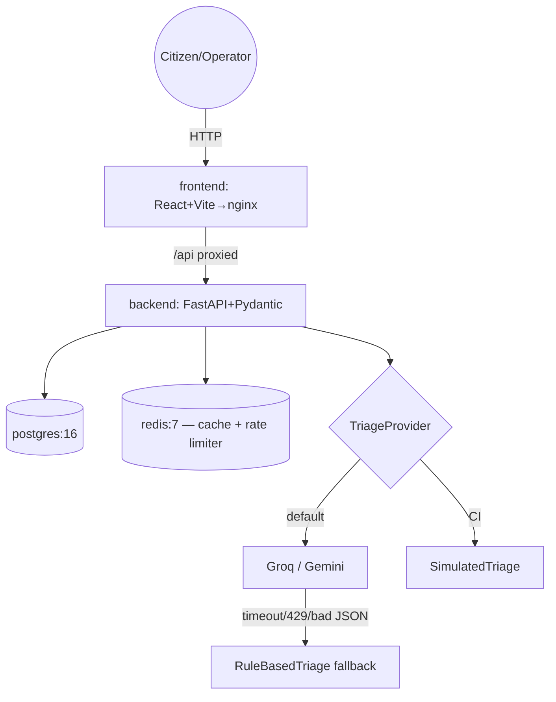

# CivicPulse

Municipal complaint intake, triage and operations platform. A citizen
submits a complaint; an AI (or rule-based fallback) triages it into a
category, priority and one-line summary; operators track it on a live
dashboard.

## Architecture

## Quickstart Step
cp .env.example .env

edit .env: set POSTGRES_PASSWORD at minimum

docker compose up -d --build

Open `http://localhost:8080`.

## API

| Method | Path | Behaviour |
|---|---|---|
| POST | `/api/complaints` | Validate → triage → persist. 201 / 400 / 429 |
| GET | `/api/complaints/{id}` | 200 / 404 |
| GET | `/api/complaints` | Filter + paginate |
| PATCH | `/api/complaints/{id}/status` | State machine. 200 / 409 |
| GET | `/api/stats` | Aggregates, Redis-cached, `X-Cache` header |
| GET | `/api/meta/providers` | Active provider + last 20 triage outcomes |
| GET | `/health` / `/ready` / `/metrics` | Liveness / readiness / Prometheus |

## Documentation
- [ADRs](docs/adr/)
- [Runbook](docs/RUNBOOK.md)
- [Engineering notes](docs/ENGINEERING-NOTES.md)
- [AI usage](docs/AI-USAGE.md)